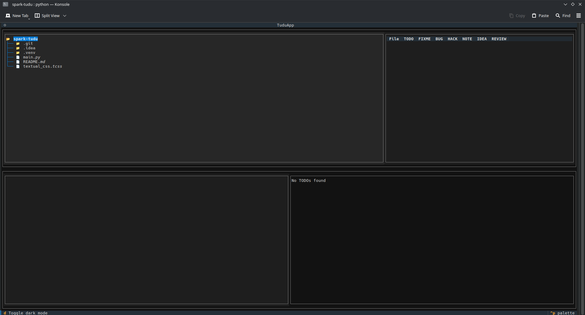
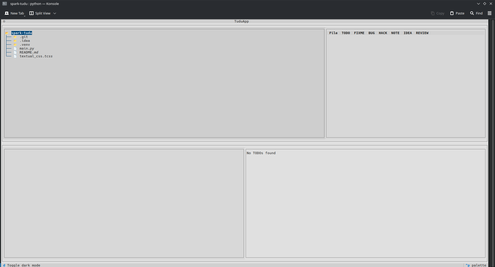

# spark-tudu

# Navigation
- [About project](#about-project)
  - [Motivation for the project](#motivation-for-the-project)
  - [Learning outcomes](#learning-outcomes)
- [Project status](#project-status)
  - [Planned features](#planned-features)
- [Syntax](#syntax)
- [Installation and usage](#installation-and-usage)
- [Supported markers](#supported-markers)
- [Dependencies](#dependencies)
- [Images](#images)
- [License](#license)

# About project
spark-tudu is simple TUI app written in Python to help you develop your projects. It searches for lines like TODO or FIXME in app's syntax ([about syntax](#syntax)) and provides it to you in one place in TUI written in Textual.

## Motivation for the project
Motivation for this project comes from both need for simple project when returning to coding, and from needing a simple program that puts all my TODOs from different files inside one space.

## Learning outcomes
I learned how to use Textual and how to make TUI apps.

# Project status
Minimum Viable Product is done. It was made in 3 hours. This isn't finished version yet, as project has more features planned.

## Planned features
- Opening specific file with specific line selected using control and enter
- Adding priority levels to syntax
- Better deadline handling
- Filtering options
- Rescan option
- Export of results
- Better table design
- Project summary screen
- Packaging it as binary for Linux and executable for Windows
- Uploading it to PyPI and the AUR

# Syntax
App detects comments with this syntax:

`language comment prefix marker/comment/deadline`

Example:

`# TODO/Add themes/22.10.2027`

# Installation and usage
Download `.py` file from GitHub Releases and run it through terminal of your choice using `python main.py` in project directory. You can also clone this project using `git clone https://github.com/emb3rcia/spark-tudu`

# Supported markers
Currently supported markers:
- TODO
- FIXME
- BUG
- HACK
- NOTE
- IDEA
- REVIEW

# Dependencies
- `textual`
- `rich`

Install command for PyPI: `pip install textual rich`

Install command for Arch-based distributions: `sudo pacman -S python-textual` (`python-rich` is installed as dependency of `python-textual`)

# Images

# License
All files are licensed under the Apache 2.0 License.

See `/Licenses/Apache-2.0.txt` for full terms